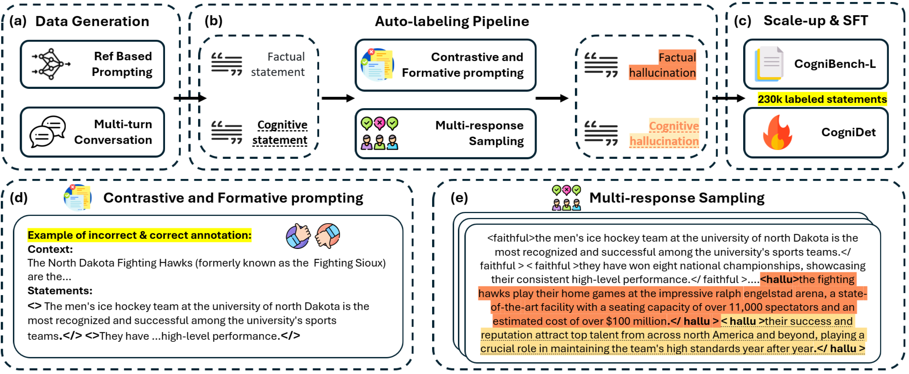

# <center>CogniBench: A Legal-inspired Framework and Dataset for Assessing Cognitive Faithfulness of Large Language Models</center>


Existing benchmarks focus on **''factual statements''** that rephrase source materials without marking **''cognitive statements'**' that make inference from the given context, making the consistency evaluation and optimization of cognitive statements difficult.

To address this gap:

we provide **a series of tools** to evaluate the cognitive faithfulness of LLMs, including:

1. [**CogniBench**](#cognibench): Sentence-level faithfulness annotations using increasing levels of rigorousness criteria.
2. [**Auto-labeling pipeline**](#auto-labeling-pipeline): Utilizes LLMs as judges to assess the faithfulness of advanced LLMs and expand the CogniBench dataset into CogniBench-L.
3. [**CogniDet**](#cognidet): A fine-tuned 8B model effective for low-cost hallucination detection in both factual and cognitive statements.


## CogniBench

CogniBench is the first knowledge-grounded dialogue dataset and framework for assessing cognitive faithfulness.


Example of Annotated Data


### Dataset Structure

[dialogues.json](data/dialogues.json) contains structured dialogue data::

```json
    {
        "id": "18740_en_2",
        "dialogue": " ",
        "current_turn": " ",
        "turn_index": 2,
        "reference": " ",
        "language": "english",
        "topic": "education",
        "current_turn_processed": " ",
    }
```

`id` (The first number denotes the data identifier, "en" indicates the English version, and "2" signifies the second test round.)

`dialogue` (All user and assistant dialogues under this data identifier.)

`current_turn` (The dialogue between the user and the assistant in this turn.)

`turn_index` ("2" signifies the second test round)

`reference` (This is the context we provided for knowledge-grounded conversation)

`language` (The type of language)

`topic` (The dialogue's topic)

`current_turn_processed` (The assistant's answer in this turn)


[labels.json](data/labels.json) contains faithfulness annotations:

```json
"ID_OF_DIALOGUE": {
        "hallu_list": [ ],
        "irrelevant_list": [ ],
        "faithfulness_list": [ ],
        "factual_hallu_list": [ ],
        "cognitive_hallu_list": [ ],
        "misleading_list": [ ],
        "speculative_list": [ ],
        "realiable_list": [ ],
        "irrefutable_list": [ ],
        "factual_list": [ ],
        "cognitive_list": [ ],
        "sentence_label_dict": { }
    }
```
`sentence_label_dict` (Summary of the Sentences-level annotation)

`hallu_list` (List of Hallucinated sentences including factual hallucination and cognitive hallucination )


`factual_list` (List of Factual sentences)

`cognitive_list` (List of Cognitive sentences)


## Auto-labeling pipeline

Proposed pipeline for hallucination proxy annotation


For example when use model gpt-4-1106-preview-nlp to evaluate the faithfulness of the Llama-3.1

Step 1: First generate the data using [RefGPT](https://github.com/mutonix/RefGPT)

Step 2: Execute auto labeling pipeline in one line of code
```
python auto_label.py --input_path data/Llama-3.1-70B-Instruct_processed.jsonl --method multi_run --prompt_version v2_2 --data_verson 300_turn --model_name  gpt-4-1106-preview-nlp --dialogue_model
```


## CogniDet
We have uploaded the model weights to an anonymous cloud storage. You can access them here: 

[Download CogniDet Weights](https://mega.nz/folder/QIIwnBxY#ltYWLtCzJih-YrHRFeNqnQ)